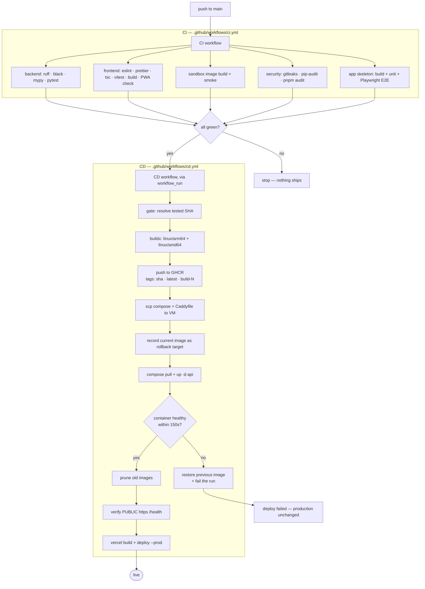

# BuildSmith — DevOps Implementation

CI/CD, configuration management, containerisation & orchestration, and observability for
**BuildSmith**, an AI-native PWA that takes a web-app idea through requirements → design → build →
test + self-healing repair → deploy → live validation.

Backend runs on an **Oracle Cloud Ampere A1 (arm64) VM**; frontend on **Vercel**.

---

## 1. What the system looks like

```
                    ┌──────────────────────────────────────────────┐
   developer ──push─►  GitHub                                       │
                    │   ├─ CI  workflow  (lint · types · tests)     │
                    │   └─ CD  workflow  (build · push · deploy)    │
                    └───────────┬──────────────────────┬───────────┘
                                │                      │
                   ghcr.io/<owner>/BuildSmith-api       │ vercel deploy --prod
                    (linux/arm64 + linux/amd64)        │
                                │                      ▼
                                │              ┌───────────────┐
                                │              │    Vercel     │  React + Vite PWA
                                │              │  (frontend)   │  VITE_API_BASE_URL ──┐
                                │              └───────────────┘                      │
                                │                                                     │
                                ▼                                                     │
  ┌───────────────────────────────────────────────────────────────────────────────────┼──┐
  │ ORACLE ARM VM (Ubuntu, aarch64)                                        HTTPS ◄─────┘  │
  │                                                                                       │
  │   nginx :443  ── TLS termination + WebSocket upgrade ──► 127.0.0.1:8000               │
  │        │                                                                              │
  │        ▼                                                                              │
  │   ┌──────────────────── docker compose (PRODUCTION) ───────────────────┐              │
  │   │  api ──┬── mongo    (control-plane metadata)                       │              │
  │   │        ├── appdb    (generated-app data)                           │              │
  │   │        └── /var/run/docker.sock ──► BuildSmith-sb-* sandboxes       │              │
  │   │  caddy :8080 ── preview routing by container name ──────┘          │              │
  │   └────────────────────────────────────────────────────────────────────┘              │
  │                                                                                       │
  │   ┌──────────── k3s (ORCHESTRATION DEMO) ────────┐  ┌──── monitoring ──────────────┐  │
  │   │ Deployment BuildSmith-api (2 replicas)        │  │ prometheus ◄─ /metrics       │  │
  │   │ StatefulSet mongo + PVC                      │  │     ▲   ▲   ▲                │  │
  │   │ Service · Ingress · PDB                      │  │     │   │   └─ blackbox      │  │
  │   │ rolling update · rollback                    │  │  node-exp cadvisor           │  │
  │   └──────────────────────────────────────────────┘  │     └──► grafana :3000       │  │
  │                                                      └──────────────────────────────┘ │
  └───────────────────────────────────────────────────────────────────────────────────────┘
```

### Why two runtimes

This is the one architectural decision worth explaining, because it looks like indecision and is
not.

BuildSmith creates **a Docker container per project** to run untrusted generated code, and its
preview proxy routes to those containers **by name** via Docker's embedded DNS on an internal
bridge network. Generated apps reach their database the same way (`BuildSmith-appdb`).

Running the control plane as a Kubernetes pod breaks that. Mounting the Docker socket via
`hostPath` solves sandbox *creation*; it does not solve sandbox *routing*, because a pod on the CNI
cannot resolve `BuildSmith-sb-<id>`. Fixing that means rewriting preview discovery to use IP
addresses — a change to how the **application** works, not how it is deployed.

So compose keeps serving production with every stage functional, and k3s carries the orchestration
deliverable with the sandbox-backed stages inert (the app fails soft and says so in its logs).
Splitting them also means a failed demo can never take production down.

---

## 2. Pipeline flow



### Design decisions in the pipeline

**`workflow_run`, not `push`.** A push-triggered deploy *races* CI — both start from the same
commit simultaneously, so a deploy can be serving traffic while the test job that would have
failed it is still running. Gating on `workflow_run` + `conclusion == 'success'` makes "CI passed"
an actual precondition rather than a coincidence.

**Immutable SHA tags, never `latest`.** Rollback has to mean something. If the VM tracked
`latest`, rolling back after a bad deploy would roll back *to the bad deploy*, because that is
where `latest` now points.

**The previous image is recorded before anything changes.** `BuildSmith_IMAGE` in `/opt/BuildSmith/.env`
is read and kept before the new tag is written, so the rollback target is a known-good value rather
than a guess.

**Health is polled, not slept on.** The image declares a `HEALTHCHECK`, so the deploy watches the
same signal Docker itself uses, and gives up after a bounded number of attempts.

**Two health checks, deliberately.** The VM checks `127.0.0.1:8000/health` (is the container up?);
the runner then checks `https://<domain>/health` (can a *user* reach it?). The second catches the
case where the container is perfectly healthy and nginx is misconfigured.

**Frontend deploys after the backend.** The Vercel build bakes in `VITE_API_BASE_URL`; shipping it
first would point a new UI at an old API.

---

## 3. Deliverables by step

| Step | Deliverable | Where |
|---|---|---|
| **1** | CI + CD pipelines, pipeline diagram | [`.github/workflows/ci.yml`](../../.github/workflows/ci.yml), [`cd.yml`](../../.github/workflows/cd.yml), [`k8s-rollout.yml`](../../.github/workflows/k8s-rollout.yml), §2 above |
| **2** | Ansible playbook, roles, inventory | [`infra/ansible/`](../../infra/ansible/) · [README](../../infra/ansible/README.md) |
| **3** | Dockerfile, compose, K8s manifests, rolling update + rollback | [`backend/Dockerfile.prod`](../../backend/Dockerfile.prod), [`infra/docker-compose.prod.yml`](../../infra/docker-compose.prod.yml), [`infra/k8s/`](../../infra/k8s/) · [README](../../infra/k8s/README.md) |
| **4** | Prometheus + Grafana, app metrics, dashboard, alerts | [`infra/monitoring/`](../../infra/monitoring/), [`backend/app/core/metrics.py`](../../backend/app/core/metrics.py) |
| **5** | This document + slides | `docs/devops/` |

---

## 4. Verification — what was actually run

Everything below was executed, not asserted. Raw output in [`evidence/`](evidence/).

| Check | Tool | Result |
|---|---|---|
| Workflow syntax + embedded shell | `actionlint` (+shellcheck) | 3 workflows, **0 findings** |
| K8s manifests | `kubeconform -strict` (k8s 1.31) | **9/9 valid** |
| Ansible | `ansible-lint` at `production` profile | **0 failures, 0 warnings** (30 files) |
| Prometheus config + rules | `promtool check` | **valid, 10 rules** |
| nginx config | `nginx -t` | **valid**, both variants |
| WebSocket upgrade through nginx | live handshake | **`101 Switching Protocols`** |
| Production image | `docker build` + run | **healthy**, non-root uid 10001 |
| `/metrics` content | live scrape | route templates, no secrets |
| Rolling update on real k3s | measured probe | **807 requests, 0 failures** |
| Broken release | real k3s | detected, **auto-rolled back**, 0 requests served |
| Monitoring stack | live | **5/5 targets up**, 16 panels, 10 alerts |
| Backend test suite | `pytest` | **1648 passed** |

### The nginx WebSocket result is worth singling out

BuildSmith's realtime hub is a WebSocket. A standard `proxy_pass` block does **not** forward the
upgrade handshake. Tested both ways against a real nginx:

| Config | Result |
|---|---|
| With `proxy_http_version 1.1` + `Upgrade` + `Connection` | `101 Switching Protocols` ✅ |
| Without them | `200 OK` — upgrade silently swallowed ❌ |

The failure mode is nasty: every REST call works perfectly, nothing appears in any error log, and
the only symptom is that live build/test streaming never connects.

---

## 5. Challenges

**1. Kubernetes could not host the real runtime.**
Described in §1. The honest resolution was to keep compose in production and use k3s for the
orchestration deliverable, rather than quietly ship a deployment where a third of the product
does not work.

**2. Oracle Cloud has two firewalls, and the one on the VM lies to you.**
Oracle's Ubuntu images ship an iptables ruleset whose `INPUT` chain ends in a blanket `REJECT`.
ufw writes to a *different* chain — so `ufw allow 443` succeeds, `ufw status` shows the port open,
and packets are still dropped. The `firewall` role detects those rules, removes them by
**specification** rather than by index (deleting by index while the chain shifts removes the wrong
rule — and the wrong rule is the one keeping SSH open), then purges `iptables-persistent` —
which ufw `Breaks` anyway — so nothing reloads them on reboot; ufw persists its own rules. The OCI Security List is a genuinely separate
firewall that no playbook can reach.

**3. arm64.** GitHub's runners are amd64; the VM is aarch64. An amd64-only image pulls fine and
dies with `exec format error`. Solved with QEMU + buildx multi-platform builds; the arm64 leg
dominates build time under emulation, hence the registry layer cache.

**4. The Caddy preview proxy broke twice, in ways only testing found.**
The dev Caddyfile indexes host labels (`{http.request.host.labels.3}`), which works only because
`preview.localhost` is a fixed two-label suffix. Labels are counted **right-to-left**, so on a real
domain that index silently resolves to the TLD. Rewrote it to anchor a regex on the left, where the
project id actually is. Then a second bug: with `auto_https off`, a bare hostname site address
still makes Caddy listen on **:443**, so it never saw the plain HTTP nginx forwards — fixed by
pinning `http://`. Both were found by sending real requests, not by reading the config.

**5. Metric cardinality.** `/projects/{id}/artifacts` as a raw path label would mint a time series
per project, and a scanner hitting random URLs on a public VM could mint one per probe. The `path`
label is the **route template** (`scope["route"].path_format`), and unmatched requests collapse into
a single `<unmatched>` bucket. cAdvisor needed the same treatment — BuildSmith creates and destroys
sandbox containers constantly, so its per-container series are dropped to the handful the dashboard
uses.

**6. An error-rate panel that goes blank when nothing is wrong.**
`sum(rate(...{status=~"5.."}))` returns an *empty* vector when no 5xx series exist, and empty
divided by anything is still empty — so a perfectly healthy service rendered as "No data". Only
visible because the dashboard's queries were run against a live Prometheus. Fixed with
`or vector(0)`.

**7. Adding metrics without touching the app's architecture.** BuildSmith forbids reading
`os.environ` outside its config layer (CI enforces it) and has a test asserting the exact set of
unauthenticated routes. Adding `/metrics` meant registering two keys through the layered config
registry and declaring the endpoint public **deliberately**, in a reviewable diff — which is
exactly what that guard is for.

---

## 6. Lessons learned

**Validate by execution, not by inspection.** Every config in this project parsed correctly while
being wrong. The Caddy label bug, the `:443` bug, the missing WebSocket headers, the blank
error-rate panel — all invisible to a linter, all obvious within seconds of sending a real request.
Spinning up a throwaway k3s cluster and a real Prometheus cost maybe an hour and found five genuine
bugs.

**Test the negative case.** Proving the WebSocket headers work is half the evidence. Removing them
and watching the handshake degrade to a silent `200 OK` is what proves they are load-bearing rather
than cargo-culted.

**"Zero downtime" is a measurement.** A rolling update that looks fine proves nothing. Counting 807
requests with 0 failures across an update, a failed release and a rollback is a claim; watching pods
change colour is an anecdote.

**A deploy command that returns is not a deploy that worked.** `kubectl set image` and
`docker compose up -d` both return before anything is serving. Every deploy path here waits on a
real health signal and treats the timeout as failure — that timeout is the only thing that makes
automatic rollback possible.

**Make the dangerous thing loud.** `FERNET_KEY` regeneration is unrecoverable, so the playbook
reads the existing value back rather than re-templating it, and says why in three separate places.
Idempotency here is not tidiness; it is the difference between a re-run and data loss.

**Additive configuration management.** The VM already runs someone else's project. The nginx role
writes exactly one new file, never touches `nginx.conf`, warns on a `server_name` collision,
validates before reloading, and uses `reload` rather than `restart`. Automation that shares a box
has to be a good neighbour.

---

## 7. Runbook

```bash
# --- provision (once, from macOS or WSL) --------------------------------------
cd infra/ansible
cp inventory.example.ini inventory.ini && $EDITOR inventory.ini
$EDITOR group_vars/all.yml                     # BuildSmith_domain is required
ansible-galaxy collection install -r requirements.yml
ansible-playbook site.yml --check --diff       # dry run first
ansible-playbook site.yml

# --- deploy ------------------------------------------------------------------
git push origin main                           # CI -> CD -> VM + Vercel
# or, manually: Actions -> CD -> Run workflow (optionally pin an image_tag)

# --- kubernetes demo ---------------------------------------------------------
make k8s-validate
make k8s-apply
make k8s-rollout IMAGE=ghcr.io/<owner>/BuildSmith-api:<tag>
make k8s-rollback
make k8s-demo V1=:v1 V2=:v2

# --- monitoring --------------------------------------------------------------
ssh -L 3000:127.0.0.1:3000 -L 9090:127.0.0.1:9090 ubuntu@<vm>
# Grafana http://localhost:3000 · Prometheus http://localhost:9090

# --- lint everything ---------------------------------------------------------
make devops-lint
```

### Required GitHub configuration

**Secrets** (Settings → Secrets and variables → Actions → Secrets):

| Name | Value |
|---|---|
| `VM_HOST` | VM public IP or hostname |
| `VM_USER` | SSH user (`ubuntu`) |
| `VM_SSH_KEY` | Private key, full PEM including header/footer |
| `VM_SSH_KNOWN_HOSTS` | Output of `ssh-keyscan <vm-host>` — pins the host key instead of disabling the check |
| `VERCEL_TOKEN` | Vercel account token |
| `VERCEL_ORG_ID` | From `.vercel/project.json` after `vercel link` |
| `VERCEL_PROJECT_ID` | Same file |
| `KUBECONFIG_B64` | *(optional, k8s workflow)* `base64 -w0 ~/.kube/config` |

**Variables** (same page → Variables):

| Name | Value |
|---|---|
| `BuildSmith_DOMAIN` | Your API subdomain, no scheme |
| `VM_SSH_PORT` | *(optional)* defaults to 22 |

`GITHUB_TOKEN` is built in — no PAT needed to push to GHCR from this repo.

---

## 8. Known limitations

Stated plainly rather than discovered later.

- **Sandbox-backed stages do not work in the k3s cluster** (§1). They work fully in production.
- **Single replica of Mongo**, in both runtimes. A real replica set needs three members and an
  initiator job.
- **One API replica in production.** The control plane keeps WebSocket subscribers, the realtime
  replay ring, and its rate-limiter counters in *process* memory. A second worker would silently
  halve the rate limits and drop half the realtime subscribers. Scaling horizontally means moving
  that state to Redis first — `--workers 2` would be a bug, not a speedup.
- **No Alertmanager.** Rules are defined and evaluated, and fire in Prometheus; routing them to
  email/Slack is a further step.
- **Preview subdomains need wildcard DNS + a wildcard certificate** (DNS-01). Left off by default;
  everything else works without it.
- **The sandbox image is not built by CD.** Build `BuildSmith-sandbox:latest` on the VM once, and
  again whenever `sandbox/` changes (see `DEPLOYMENT.md` §5). Without it the API runs but no
  project can build, preview or test. (The earlier red-CI blocker — `mypy` errors and two failing
  tests — was fixed on 2026-09-19.)
